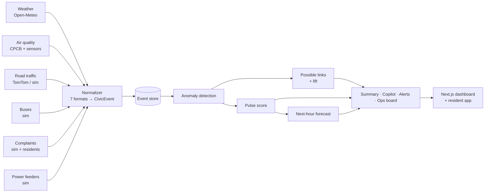
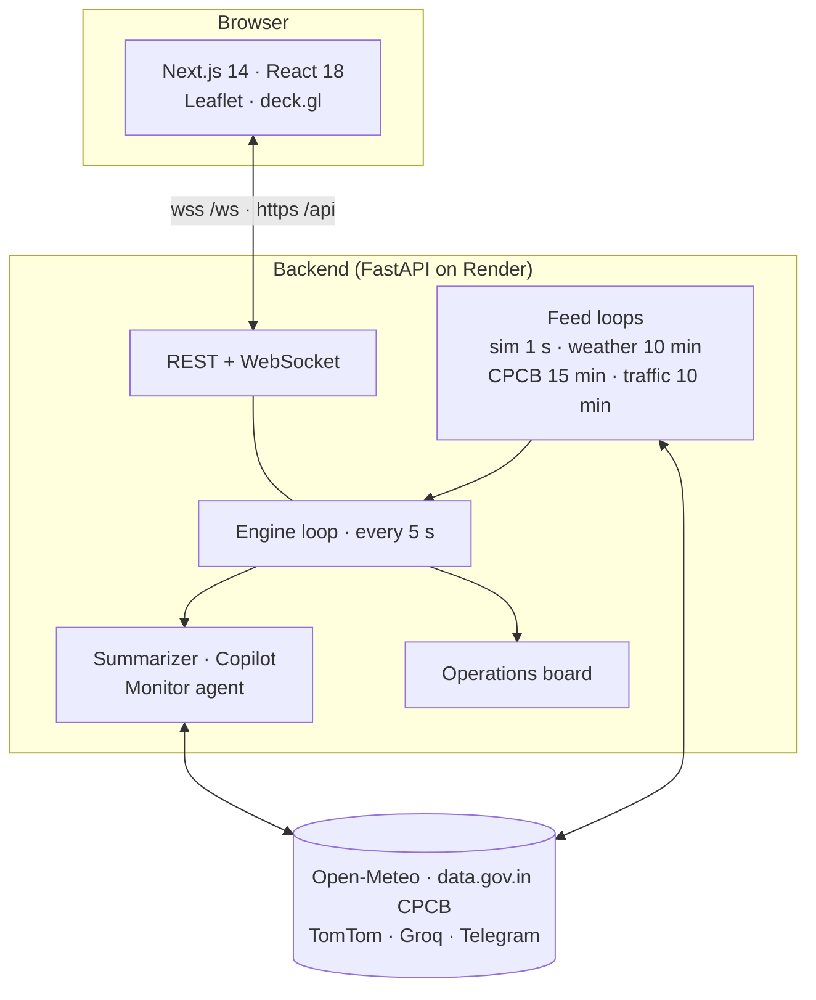

<div align="center">

# 💓 CityPulse

### Live Civic Health Intelligence for Jaipur

**One heartbeat for the whole city.** CityPulse fuses weather, air quality, traffic, buses, citizen complaints and power-grid feeds into a single live pulse per neighbourhood. It explains the pulse in plain English and Hindi, looks one hour ahead, and routes every problem to the department that owns it.

[](https://nextjs.org/)
[](https://fastapi.tiangolo.com/)
[](https://www.python.org/)
[](https://groq.com/)
[](https://vercel.com/)
[](https://render.com/)

[**Live Demo**](https://city-pulse-theta.vercel.app) · [**API Docs**](https://citypulse-api-j95x.onrender.com/docs) · [**Demo Video**](#) · [**Report a Bug**](https://github.com/piyushinfo/CityPulse/issues)

*Built for **AmiHacks — Track B: CityPulse, The Live Civic Health Dashboard***

</div>

---

## 📑 Table of Contents

- [The Problem](#-the-problem)
- [Our Solution](#-our-solution)
- [Key Features](#-key-features)
- [Screenshots](#-screenshots)
- [How It Works](#-how-it-works)
- [Does It Work? (Backtest)](#-does-it-work-backtest)
- [Architecture](#-architecture)
- [Data Sources](#-data-sources)
- [Tech Stack](#-tech-stack)
- [Getting Started](#-getting-started)
- [Environment Variables](#-environment-variables)
- [API Reference](#-api-reference)
- [Project Structure](#-project-structure)
- [Testing](#-testing)
- [Deployment](#-deployment)
- [Design Principles: Honesty & Privacy](#-design-principles-honesty--privacy)
- [Roadmap](#-roadmap)
- [Team](#-team)
- [Acknowledgements](#-acknowledgements)
- [License](#-license)

---

## 🚨 The Problem

Every city department watches its own monitor. The weather office sees rain, the power utility sees a tripped feeder, the bus operator sees delays, and the complaints desk sees a pile of waterlogging reports. **Nobody sees the patient.**

When a monsoon storm hits Jaipur's Walled City, these signals rise together within minutes, but they live in different systems, in different formats, on different clocks. Residents get no single answer to the only question they care about: *"Is my area okay right now, and will it get worse?"*

## 💡 Our Solution

CityPulse treats the city like a patient in intensive care:

| Medicine | CityPulse |
| --- | --- |
| Vital signs | 6 live civic feeds |
| One monitor | One common event schema |
| Heart rate | A pulse score (0–100) and BPM per zone |
| Diagnosis | Anomaly detection plus "possible links" between feeds |
| Prognosis | Next-hour outlook per zone |
| Care team | Incidents routed to the owning department |

---

## ✨ Key Features

### For the control room
- **🫀 Live Command Center:** a map of 8 Jaipur zones, each with a beating ECG line whose speed and colour reflect stress. Readable in 10 seconds.
- **🗺️ 2D and 3D maps:** Leaflet heatmap, plus a deck.gl 3D view where each zone's height is its stress and it "breathes" at its own heart rate.
- **🔗 Correlation Lab:** cross-feed "possible links" (for example *heavy rain → waterlogging → bus delays*), each with a timeline and a history check ("these co-occurred 16× more often than chance").
- **🔮 Next-hour Forecast:** trend plus the official hourly weather forecast, compared with how each zone behaved under the same weather before. It warns *before* a storm arrives.
- **🧑‍✈️ Operations Board:** every anomaly becomes an incident card, pre-routed to the right department (JMC Drainage, JVVNL, Traffic Police, JCTSL, RSPCB). Officers acknowledge, assign and resolve it, and the board tracks time-to-acknowledge and time-to-resolve.
- **🤖 AI Copilot:** ask questions in plain language. Answers are grounded in live data, and a validator rejects any invented number or causal claim.
- **📊 Analytics, Incident Center, Replay:** trends, incident timelines, and a 3-day historical replay.
- **✅ Backtest:** the system scores itself on history (see [below](#-does-it-work-backtest)).
- **🧪 Explainability:** a raw-vs-normalized view that shows every feed's original format next to the unified event.

### For residents (`/resident`, mobile-first)
- **🇮🇳 Hindi + English:** "my area" status, next-hour outlook, and practical tips ("avoid underpasses", "keep your phone charged").
- **📣 One-tap reporting:** report waterlogging, a power cut, a signal outage and more. No name, no text, no exact location.
- **🔔 Area alerts:** a browser notification when your zone turns red, plus optional per-zone Telegram groups.
- **🔊 Read aloud:** the status and tips are spoken in Hindi or English for accessibility.

### Built to survive the real world
- **Graceful degradation:** a dead feed is marked offline, the picture is flagged "partial", and everything else keeps working.
- **Kill-feed demo:** switch off any feed live to prove it.
- **Real + simulated data:** real APIs where Jaipur publishes data, and realistic simulators (with the same payload shapes) where it doesn't.

---

## 📸 Screenshots

> Add your screenshots to `docs/screenshots/` and they will render here.

| Command Center | Monsoon scenario |
| --- | --- |
|  |  |

| Operations Board | Resident View (Hindi) |
| --- | --- |
|  |  |

| 3D City | Backtest |
| --- | --- |
|  |  |

---

## ⚙️ How It Works



**1. Ingest.** Six feeds arrive in **seven different formats**: IST strings without offsets, epoch milliseconds, epoch seconds, `dd/mm/yyyy` strings, ISO-8601 UTC, station coordinates, and area names.

**2. Normalize.** Every record becomes one `CivicEvent`: UTC time, zone, value, unit, and a severity from 0 to 1. Complaints are privacy-scrubbed at this step.

**3. Detect anomalies.** Two rule types:
- **Spikes (z-score):** counts in the last 30 minutes are compared with a robust 3-day baseline that ignores the busiest 10% of windows.

  $$z = \frac{n - \mu}{\max(\sigma, \sqrt{\mu}, 1)} \geq 3$$

- **Thresholds:** heavy rain ≥ 7.6 mm/h (IMD), heat ≥ 42 °C, PM2.5 > 90 µg/m³ (CPCB "poor"), congestion ≥ 0.5, or any tripped feeder.

**4. Find possible links.** Two anomalies of different types in the same zone, starting within 45 minutes of each other, become a link. We keep a link only if the history shows the pair co-occurs more than chance:

$$\text{lift}(A,B) = \frac{P(A \cap B)}{P(A)\,P(B)} \geq 1.5$$

Links are labelled *strong pattern* (lift ≥ 3), *some pattern*, or *new, unverified*, and always described as **possible, never causal**.

**5. Score the pulse.** Each active anomaly adds stress by category weight × severity:

$$\text{pulse} = 100 \times \prod_i (1 - w_i \cdot s_i), \qquad \text{BPM} = 60 + 0.6 \times (100 - \text{pulse})$$

Calm is 75–100 (green), watch is 50–74 (amber), and alert is below 50 (red). The city's colour follows its **worst** zone, so one flooded area is never averaged away.

**6. Look ahead.** The next-hour estimate combines the 15-minute trend with the hourly weather forecast, compared with each zone's median pulse under that weather in the last 3 days. Every arrow shows its reason.

**7. Explain and act.** A template summary is always available. The Groq LLM version is shown only if it passes validation. The monitoring agent raises alerts with a 10-minute cooldown, and the operations board turns anomalies into accountable work.

---

## 📈 Does It Work? (Backtest)

CityPulse replays its 3-day history through **the exact code that runs live** and scores itself (`/backtest`):

| Metric | Result |
| --- | --- |
| Storms and heatwaves detected | **3 / 3** (mean 15 min after onset) |
| Warned before onset | **3 / 3** (≈ 60 min ahead\*) |
| Next-hour forecast vs "no change" baseline | **~15% lower error** |
| Red zones during calm weather | ~4 per day across 8 zones |

> \* **Honest caveat:** the history is simulated, so this validates the detection and forecasting *pipeline*, not real-world accuracy. The warning lead assumes the weather forecast was right. With real feeds, the same code produces real scores.

---

## 🏗️ Architecture



The analysis core is **pure**: the state is a function of `(events, time)`. That's why the same code powers live mode, 3-day replay and the backtest.

---

## 🛰️ Data Sources

| Feed | Source | Type | Update |
| --- | --- | --- | --- |
| Weather + hourly forecast | [Open-Meteo](https://open-meteo.com/) | **Real** (no key) | 10 min |
| Air quality (stations) | CPCB via [data.gov.in](https://data.gov.in/) | **Real** | 15 min |
| Air quality (city baseline) | Open-Meteo Air Quality | **Real** | 30 min |
| Air quality (per-zone sensors) | Simulator, seeded by the real city PM2.5 | Simulated | 60 s |
| Road congestion | [TomTom Traffic Flow](https://developer.tomtom.com/) | **Real** with key, else simulated | 5–10 min |
| Bus delays | Simulator (JB-1/2/3 routes) | Simulated | live |
| Citizen complaints | Simulator + **real resident reports** | Mixed | live |
| Power feeders | Simulator | Simulated | live |

The simulators share one `World` state, so their correlations are **causal by design and discovered, not hard-coded, by the detector**. Rain raises waterlogging, bus delays and feeder trips; outages knock out traffic signals; congestion raises PM2.5. All simulators emit exactly the payload shapes of real APIs, so each can be replaced by a real feed in one function.

**Zones (Jaipur):** Walled City · Vaishali Nagar · Mansarovar · Malviya Nagar · Tonk Road / Sanganer · Sitapura Industrial · Jagatpura · Amer Road / Jal Mahal.

---

## 🧰 Tech Stack

| Layer | Technology |
| --- | --- |
| Frontend | Next.js 14 (pages router), React 18, custom CSS design system, light/dark themes |
| Maps | Leaflet + react-leaflet (2D), deck.gl 9 (3D), Esri gray canvas tiles |
| Charts | Hand-drawn SVG (ECG heartbeat, trend charts) |
| Backend | Python 3.11, FastAPI, Uvicorn, asyncio, WebSockets |
| Analysis | Pure Python: robust z-scores, lift, pulse model, forecast, backtest |
| AI | Groq LLM (auto-selects an available model) with a grounding validator |
| Alerts | Telegram Bot API, browser Notifications, Web Speech API |
| Hosting | Vercel (frontend), Render (backend) |

---

## 🚀 Getting Started

### Prerequisites
- **Python** 3.10+ ([python.org](https://www.python.org/downloads/); on Windows, tick *Add to PATH*)
- **Node.js** 20 LTS ([nodejs.org](https://nodejs.org/))
- **Git**

### 1. Clone
```bash
git clone https://github.com/piyushinfo/CityPulse.git
cd CityPulse
```

### 2. Backend (terminal 1)

<details open>
<summary><b>Windows (PowerShell)</b></summary>

```powershell
cd backend
python -m venv venv
venv\Scripts\activate
pip install -r requirements.txt
copy .env.example .env
python -m scripts.smoke_test          # must end with: ALL CHECKS PASSED
uvicorn app.main:app --reload --port 8000
```
</details>

<details>
<summary><b>macOS / Linux</b></summary>

```bash
cd backend
python3 -m venv venv
source venv/bin/activate
pip install -r requirements.txt
cp .env.example .env
python -m scripts.smoke_test
uvicorn app.main:app --reload --port 8000
```
</details>

Check it: http://localhost:8000/api/health · API docs at http://localhost:8000/docs

### 3. Frontend (terminal 2)
```bash
cd frontend
npm install --legacy-peer-deps
cp .env.example .env.local            # Windows: copy .env.example .env.local
npm run dev
```
Open **http://localhost:3000** 🎉

> Everything runs **without any API keys**, using fallbacks. Add keys (below) to switch on real CPCB data, real traffic, the AI Copilot and Telegram alerts.

### 4. Try the demo
1. On the dashboard, open the scenario controls and choose **Monsoon storm over the Walled City**.
2. Within about 30 s, the Walled City turns red, possible links appear, and the forecast says *worse*.
3. Open **Operations** and click **Assign → JMC Drainage**, then **Resolve**.
4. Open **Resident View** on your phone, switch to **हिंदी**, and tap **Read aloud**.
5. Ask the **AI Copilot**: *"Which zones need attention?"*
6. Open **Backtest** to see the self-evaluation.
7. Press **Reset** to return to calm.

---

## 🔐 Environment Variables

### Backend: `backend/.env`

| Variable | Required | Description |
| --- | --- | --- |
| `GROQ_API_KEY` | Optional | Enables the LLM summary and Copilot ([console.groq.com](https://console.groq.com/)) |
| `GROQ_MODEL` | Optional | Preferred model; falls back automatically if unavailable |
| `DATAGOVIN_API_KEY` | Optional | Real CPCB station data ([data.gov.in](https://data.gov.in/)); a rate-limited sample key is built in |
| `CPCB_CITY` | Optional | City filter for CPCB (default `Jaipur`) |
| `TOMTOM_API_KEY` | Optional | Real traffic flow; simulated when empty |
| `TELEGRAM_BOT_TOKEN` | Optional | Bot for officer alerts |
| `TELEGRAM_CHAT_ID` | Optional | Officer / control-room chat |
| `TELEGRAM_ZONE_CHATS` | Optional | Per-zone resident groups, e.g. `z1:-1001234567890,z3:-1009876543210` |
| `CITY_NAME`, `CITY_LAT`, `CITY_LON` | Optional | Defaults: `Jaipur`, `26.88`, `75.80` |
| `CORS_ORIGINS` | For deploy | Your frontend URL, e.g. `https://city-pulse-theta.vercel.app` |
| `HISTORY_DAYS`, `TICK_SECONDS`, `WINDOW_MIN`, `LINK_WINDOW_MIN` | Optional | Tuning: `3`, `5`, `30`, `45` |
| `USE_REAL_APIS` | Optional | `false` forces fully offline simulation |

### Frontend: `frontend/.env.local`

| Variable | Description |
| --- | --- |
| `NEXT_PUBLIC_API_URL` | Backend URL, e.g. `http://localhost:8000` (no trailing slash) |

> ⚠️ Never commit `.env` or `.env.local`. Both are in `.gitignore`.

---

## 📡 API Reference

Interactive docs are available at **[`/docs`](https://citypulse-api-j95x.onrender.com/docs)** (Swagger UI).

| Method | Endpoint | Description |
| --- | --- | --- |
| `GET` | `/api/health` | Service health and event count |
| `GET` | `/api/zones` | Zone polygons, centers, Hindi names |
| `GET` | `/api/state` | Full live snapshot: city, zones, anomalies, links, forecast, feeds, alerts |
| `WS` | `/ws` | The same snapshot pushed every 5 s |
| `GET` | `/api/events` | Latest normalized events (`?limit=&zone=&category=`) |
| `GET` | `/api/raw-vs-normalized` | Raw payload next to the `CivicEvent` for every feed |
| `GET` | `/api/replay/range` · `/api/replay?t=` | History range · snapshot at a past time |
| `GET` | `/api/analytics` | Trends (`?hours=&interval_min=`) |
| `GET` | `/api/zone/{zone_id}` | Zone deep-dive |
| `GET` | `/api/incidents` | Incident timeline |
| `GET` | `/api/backtest` | Self-evaluation metrics |
| `POST` | `/api/copilot` | Grounded Q&A `{ "question": "..." }` |
| `GET` · `POST` | `/api/workflow` · `/api/workflow/{id}` | Operations board · `{ "action": "acknowledge\|assign\|resolve\|reopen", "assignee": "...", "note": "..." }` |
| `GET` · `POST` | `/api/report/categories` · `/api/report` | Resident report `{ "zone_id": "z1", "category": "waterlogging" }` |
| `GET` · `POST` | `/api/scenarios` · `/api/scenario/{name}` · `/api/scenario/reset` | Demo scenarios (`monsoon`, `heatwave`) |
| `POST` | `/api/feeds/{name}/kill` · `/revive` | Graceful-degradation demo |
| `GET` | `/api/alerts` | Monitoring-agent alerts |

---

## 🗂️ Project Structure

```
CityPulse/
├── render.yaml                 # Render blueprint (backend, free plan)
├── LICENSE                     # MIT
├── backend/
│   ├── requirements.txt
│   ├── .env.example
│   ├── scripts/smoke_test.py   # end-to-end tests, no server needed
│   └── app/
│       ├── main.py             # FastAPI routes + WebSocket
│       ├── engine.py           # state computation + async feed loops
│       ├── schema.py           # CivicEvent, Anomaly, Link
│       ├── normalizer.py       # 7 raw formats → CivicEvent
│       ├── zones.py            # Jaipur zones, stops, sensors, feeders
│       ├── store.py            # time-sorted event store
│       ├── history.py          # seeded 3-day history
│       ├── scenarios.py        # monsoon, heatwave
│       ├── workflow.py         # operations board
│       ├── adapters/           # weather, air (CPCB), traffic, simulators
│       ├── analysis/           # anomaly, correlation, pulse, forecast, backtest
│       └── ai/                 # summarizer + copilot, resident text, agent
└── frontend/
    ├── pages/                  # index, zones, incidents, operations, analytics,
    │                           # correlations, forecast, replay, feeds, copilot,
    │                           # backtest, resident, explain
    ├── components/             # AppShell, CityMap, CityMap3D, Heartbeat, ZoneDrawer,
    │                           # TrendChart, LinkCard, ResidentActions, Kpi, ...
    ├── lib/                    # api.js (REST + live WebSocket hook), theme.js
    └── styles/globals.css      # design system, light + dark
```

---

## 🧪 Testing

```bash
cd backend
python -m scripts.smoke_test
```

The smoke test runs the whole pipeline without a server and checks:
- history generation, baselines and the lift table;
- storm detection in replay and in the live monsoon scenario;
- the forecast warns **before** a replayed storm;
- Hindi resident messages;
- analytics, zone and incident endpoints;
- Copilot validation (real numbers pass; invented numbers and causal claims fail);
- the operations workflow (acknowledge → assign → resolve, response-time metrics);
- resident-report rate limiting and input validation;
- backtest metrics (all events detected, forecast beats the baseline).

Expected last line: `ALL CHECKS PASSED`.

---

## ☁️ Deployment

**Backend on Render:** [citypulse-api-j95x.onrender.com](https://citypulse-api-j95x.onrender.com) — New → Web Service → this repo, then:
- Root Directory `backend`, Instance Type **Free**
- Build `pip install -r requirements.txt`
- Start `uvicorn app.main:app --host 0.0.0.0 --port $PORT`
- Env: `PYTHON_VERSION=3.11.9`, your keys, and `CORS_ORIGINS=https://city-pulse-theta.vercel.app`

**Frontend on Vercel:** [city-pulse-theta.vercel.app](https://city-pulse-theta.vercel.app) — Import → this repo, then:
- Root Directory `frontend`
- Env: `NEXT_PUBLIC_API_URL=https://citypulse-api-j95x.onrender.com`
- `frontend/.npmrc` contains `legacy-peer-deps=true` for deck.gl

> 💡 Render's free tier sleeps after 15 min idle. A free [UptimeRobot](https://uptimerobot.com/) monitor on `/api/health` every 5 minutes keeps it awake.

---

## 🛡️ Design Principles: Honesty & Privacy

- **Correlation ≠ causation.** Links are always "possibly linked", with evidence and a history check one click away.
- **No hallucinated numbers.** LLM output is validated against the exact data the model saw; invented numbers or causal words are rejected, and a deterministic template is always the fallback. The UI labels which one you're reading.
- **Transparent forecasts.** Every "next hour" arrow shows its reason; there is no black box.
- **Self-evaluation with caveats.** The backtest states plainly what it does and does not prove.
- **Privacy by design.** Complaints keep only category, time and a location rounded to about 100 m. Resident reports carry no name, no text and no personal location. The map shows zones, never individuals.
- **Abuse-resistant reporting.** One report per person, zone and category per 30 minutes, so a spike needs at least 3 different people.
- **Graceful degradation.** Missing data is shown as missing, never silently guessed.

---

## 🗺️ Roadmap

- [ ] Real 311 and JVVNL outage feeds via partnerships with the city and the utility
- [ ] Per-hour seasonal baselines once months of data exist
- [ ] Persistent storage (PostgreSQL / TimescaleDB)
- [ ] Web Push alerts that work when the resident page is closed
- [ ] Ward-level zones from official GIS boundaries
- [ ] Public read-only API for journalists and researchers

---

## 👥 Team

| Name | Role |
| --- | --- |
| **Piyush Sharma** ([@piyushinfo](https://github.com/piyushinfo)) | Frontend & Workflow |
| **Piyush Khandelwal** | Data & Simulators |
| **Mudra Vyas** | Backend & Presentation |
| **Pooja Kumari** | Analysis & Design |

---

## 🙏 Acknowledgements

- [Open-Meteo](https://open-meteo.com/) for free weather and air-quality APIs
- [CPCB](https://cpcb.nic.in/) and [data.gov.in](https://data.gov.in/) for open air-quality data
- [Esri](https://www.esri.com/), [OpenStreetMap](https://www.openstreetmap.org/copyright) contributors, [Leaflet](https://leafletjs.com/) and [deck.gl](https://deck.gl/) for maps
- [Groq](https://groq.com/) for fast LLM inference
- AmiHacks organizers and mentors

---

## 📄 License

Released under the [MIT License](LICENSE).

<div align="center">

**Made with 💓 for Jaipur**

</div>
